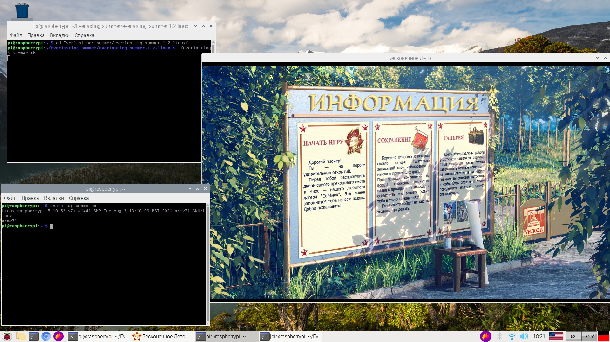

# Everlasting-summer-RaspberryPI
Files kit for running original Everlasting summer game on Raspberry PI 
#### Result


Captured on RPI 3b+ Raspbian

I think this kit can be used on any arm-based computer, but I don't have any other device to check it.
## Installation
1. Get latest version of original Everlasting Summer from [Steam](https://store.steampowered.com/app/331470/Everlasting_Summer/) 
You can do it on any platform using official Steam client. 

**Important** Using not last version (i.e used on screenshot 1.2) brings some terrible problems. Maybe these files even won't launch it, I didn't test it

2. Clone this repository
3. Copy all files from cloned repository to the Everlasting Summer folder (agree with replacement)
4. Copy changed game to your ARM pc (or do this operations on it)
5. Launch game
```
./Everlasting\ Summer.sh
```
Don't forget to make this file executable if it needed
```
sudo chmod +x Everlasting\ Summer.sh
```
6. Enjoy
## Perfomance
+ Perfomance on **RPI3** is bad. Even with light overclock in HD resolution game shows about 10fps and the most awful - opening in prologue freezes. But it is text game, thats why it's playable. Music plays without problems.
+ Perfomance on **RPI4** with 2gb RAM is good. About 900p window shows 30fps (without monitoring it's not capturable, feels like 60fps) opening in prologue plays well. Сan be played comfortably

On both computers loading is quite long (1+ minute). Htop shows that game uses only one thread, so be patient.
## Disclaimer
I don' have any rights for the game and engine files. I just collected all needed files with RenPy SDK and posted it here for peoples' convenience. 
Not all files from repository are really needed. The most important are libs folder and sh file. But replacing just them throws errors while loading. I'm too lazy to find out which are really needed, so I posted full folder. Maybe I will optimize it later
